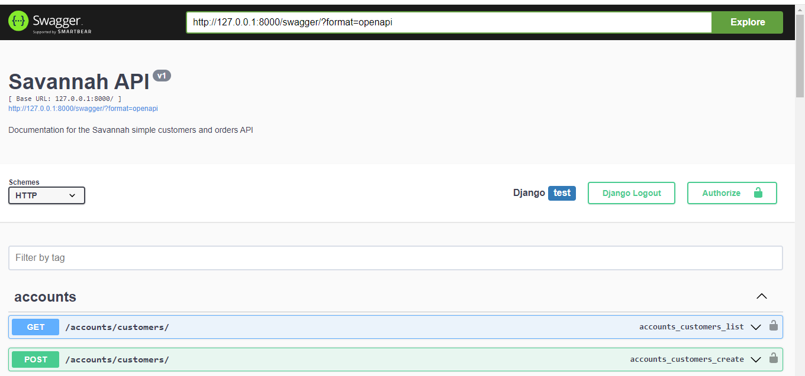
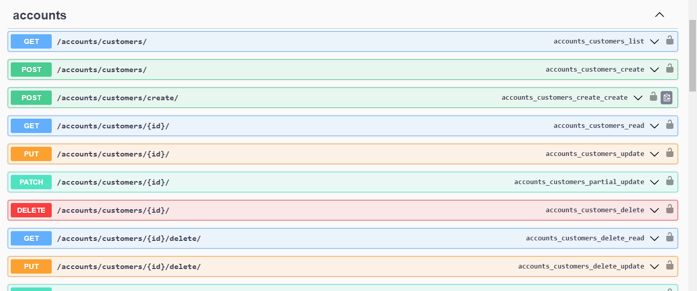
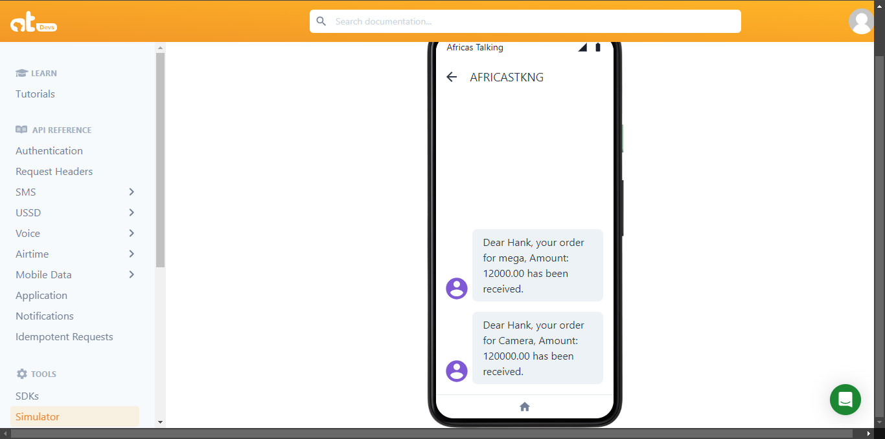

# Savannah API

Welcome to the Savannah API! This RESTful API is designed to manage customer and order data, providing authentication, user profiles, and SMS notifications. 


## Table of Contents

- [Features](#features)
- [Technologies Used](#technologies-used)
- [Getting Started](#getting-started)
  - [Prerequisites](#prerequisites)
  - [Installation](#installation)
  - [Environment Variables](#environment-variables)
  - [Database Setup](#database-setup)
- [API Endpoints](#api-endpoints)
  - [Authentication](#authentication)
  - [Customers](#customers)
  - [Orders](#orders)
- [Sending SMS Notifications](#sending-sms-notifications)
- [Testing](#testing)
- [Continuous Integration and Deployment](#continuous-integration-and-deployment)
- [Contributing](#contributing)
- [License](#license)

## Features

- User registration and authentication using OpenID Connect and Django Allauth.
- Customers can create and update their profiles.
- Orders can be created, viewed, updated, and deleted by customers.
- Admin users can manage all customers and orders.
- SMS notifications sent upon order creation.

## Technologies Used

- Django
- Django REST Framework
- Django Allauth
- PostgreSQL (or any other database of your choice)
- Africa’s Talking API for SMS
- Python
- Docker (optional for containerization)

## Getting Started

### Prerequisites

- Python 3.x
- pip
- PostgreSQL
- Virtual environment (recommended)

### Installation

1. Clone the repository:

   ```bash
   git clone https://github.com/NgothoHarrison/assessment.git
   cd assessment
2. Create and activate a virtual environment:
    ```bash
    python -m venv .venv
    source .venv\Scripts\activate
3. Install the required packages:

   ```bash
   pip install -r requirements.txt
4. Environment variables:
   ```bash
   Create a .env file in the root directory of your project and add the following variables:

5. Database setup:
   ```bash
    python manage.py makemigrations
    python manage.py migrate
Create a superuser for accessing the admin panel:
    ```bash
    python manage.py createsuperuser
Run the development server:
```bash
python manage.py runserver

### API Endpoints


## Authentication
- **Login**: `POST /auth/login/`
- **Logout**: `POST /auth/logout/`
- **Register**: `POST /auth/accounts/signup/`

## Customers
- **List all customers**: `GET /api/customers/`
- **Create a customer**: `POST /api/customers/create/`
- **Retrieve a customer**: `GET /api/customers/<int:pk>/`
- **Update a customer**: `PUT /api/customers/<int:pk>/update/`
- **Delete a customer**: `DELETE /api/customers/<int:pk>/delete/`
- **User profile**: `GET /auth/profile/`

## Orders
- **List all orders**: `GET /api/orders/`
- **Create an order**: `POST /api/orders/create/`
- **Retrieve an order**: `GET /api/orders/<int:order_id>/`
- **Update an order**: `PUT /api/orders/<int:order_id>/update/`
- **Delete an order**: `DELETE /api/orders/<int:order_id>/delete/`

## documentation 
- `GET /swagger/ `
- `GET /redoc/`


## License 
[MIT](https://choosealicense.com/licenses/mit/)